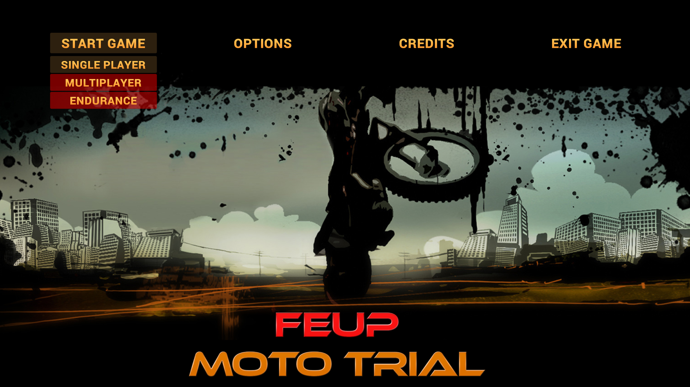
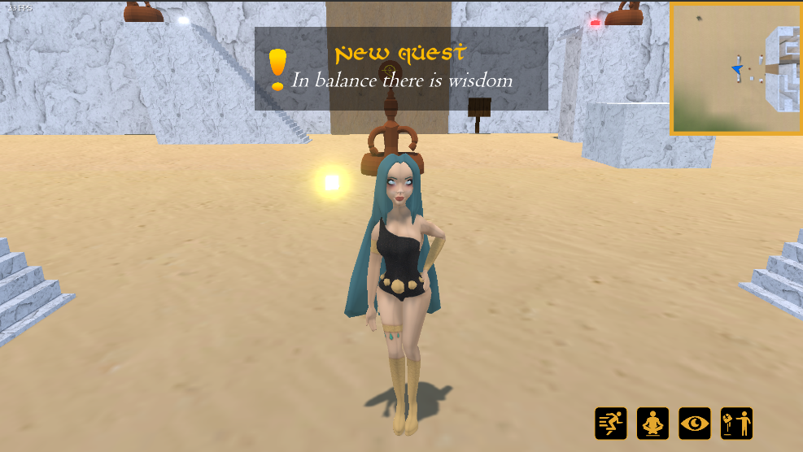
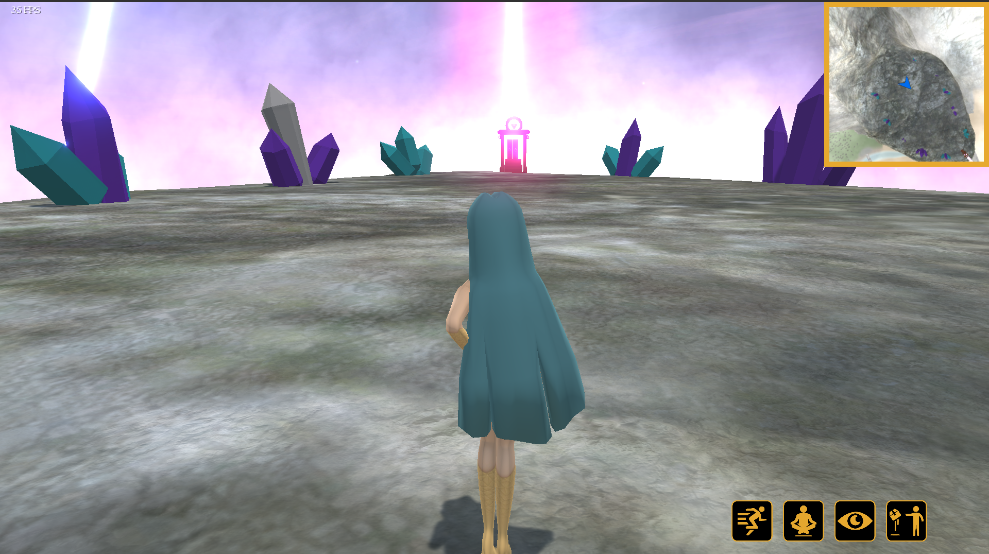

# DJCO-Computer-Games-Development
Projects made in Computer Games Development class - MIEIC 4y2s

Used Unity 2017.3.1f1

## Project 1 - FEUP Moto Trial

### Description
FEUP Moto Trial is Trials styled game. The objective of the game is to complete the levels in the shortest time possible without the driver falling of the bike. There are multiple levels with different obstacles and environments that are locked and can only be unlocked when the player completes the previous levels.
The game has various levels, each one containing a lot of obstacles.

## Final Project - Qualia

### Description
Our project will consist of a story based game taking place in a fantasy universe. The main character will be the Goddess of Sight that decides to leave her role as part of a divine group and descends to the mortal realm to experience its beauty first hand. As the story unfolds, the character will undergo emotional changes and the player will be able to see that emotional curve. The game will have multiple challenges composed of puzzles the player can pass with the help of four different powers such as Telekinesis, Speed, Levitation and the Goddess’ unique power, the ability to send an invisible beam of light that allows her to see everything she touches for a short period of time.

